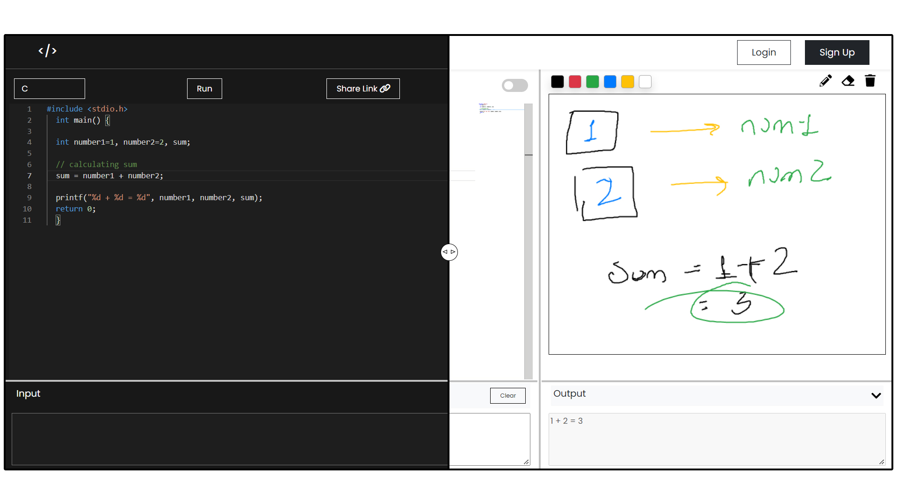

## CODE-ITE

# Description

A multi user live collaboration monaco code editor which can compile code in 3 languages (C, C++, Java) with a `whiteboard` included built using `ReactJS`, `NodeJS` and `Socket.IO`.

# Screenshot

## Steps to Setup

- Download or Clone the repository.

## Setup Environment (Client)

- `REACT_APP_BACKEND=[your-backend-url-here]`

## Installation (Client)

- `cd client`
- `npm install`
- If you want to run at https:// use run as `npm dev` else use `npm start `

## Setup Environment (Server)

- `DB_HOST=localhost`
- `DB_USER=[your-db-username-here]`
- `DB_PASSWORD=[your-db-password-here]`
- `DB_DATABASE=[your-database-here]`
- `SECRET=[your-token-secret-here]`
- `REFRESHSECRET=[your-refresh-token-secret-here]`

## Installation (Server)

- `cd server`
- `npm install`
- To start the server use `npm start `

## Authors

Contributors names and contact info

- Aniket Kumar Singh [@aniket104](https://github.com/aniket1104)
- Naman Khare [@namankhare](https://github.com/namankhare)
- Suyogya Shrivastava [@suyo7065](https://github.com/suyo7065)
